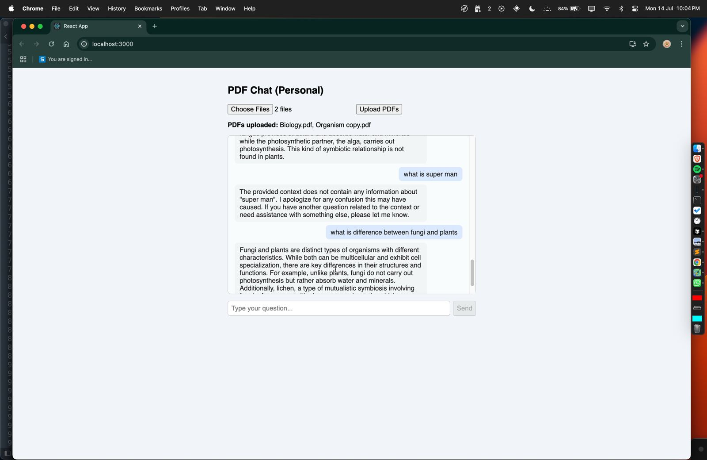

Scalable PDF RAG System with Agentic Chunking

A web application that lets you upload PDF files and chat with them! Instantly ask questions about your uploaded documents and get conversational answers, powered by local LLMs and vector search.

 Features

- Upload one or more PDF files
- Ask questions about the content of your PDFs via a chat interface
- Real-time, conversational answers
- Clean, modern React frontend
- FastAPI backend with local LLM and vector search

 Tech Stack

- Frontend: React.js
- Backend: FastAPI (Python)
- LLM & Embeddings: [Ollama](https://ollama.com/) (local LLM), [llama-index](https://github.com/jerryjliu/llama_index)
- PDF Parsing: llama-index PDFReader
- State Management: React hooks
- API Communication: REST (JSON, multipart form data)

 Requirements

- Python 3.8+
- Node.js 14+
- [Ollama](https://ollama.com/) running locally (for LLM and embeddings)
- (Recommended) mistral model pulled in Ollama:  
  
  ollama pull mistral
  

 Backend Setup

1. Install Python dependencies:
    bash
    cd backend
    pip install -r requirements.txt
    

2. Start the backend server:
    bash
    uvicorn main:app --reload --host 0.0.0.0 --port 8000
    

   > Make sure Ollama is running locally and the mistral model is available.

 Frontend Setup

1. Install Node dependencies:
    bash
    cd frontend
    npm install
    

2. Start the frontend development server:
    bash
    npm start
    

   The app will be available at [http://localhost:3000](http://localhost:3000).

 Usage

1. Open the frontend in your browser.
2. Upload one or more PDF files.
3. Ask questions about your PDFs in the chat box.
4. Get instant, conversational answers!

 Troubleshooting

- Ensure the backend is running on port 8000 and Ollama is running with the required model.
- If you see CORS errors, make sure both servers are running on localhost and the backend allows CORS.
- For large PDFs, initial processing may take a few seconds.

 Project Structure

ragperf/
  backend/
    main.py
    requirements.txt
    uploads/
  frontend/
    src/
    package.json
    ...
